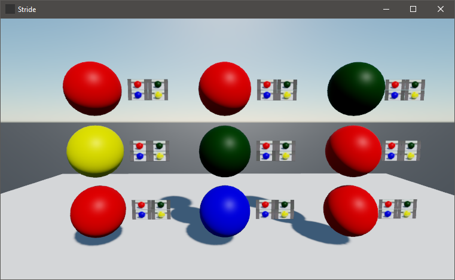

## Render Stride UIPage in Scene
Quick demo of loading a UI page and using it's events in VL.
## How To Run
* Download latest [vvvv gamma](https://visualprogramming.net) with VL.Stride
* Open `UIPageInSceneDemo.vl`



## Edit Stride Project

### Install the vvvv Stride Fork

This step is necessary until vvvv gamma uses the official Stride version.

Add the vvvv nuget feed to the `Nuget.config` file before running the Stride launcher. The file is located at either one of these paths:
* `%AppData%\NuGet\NuGet.Config`
* `%AppData%\Roaming\NuGet\NuGet.Config`

Simply add this line below to the other feeds:
```xml
<add key="vvvv-public-feed" value="http://teamcity.vvvv.org/guestAuth/app/nuget/v1/FeedService.svc/" />
```
* If you run the Stride launcher now, it shows the vvvv builds of Stride
* Install the version that is referenced in the vvvv gamma that you are running
### Open Game Solution
* Start the Stride Game Studio and open `UITestGame/UITestGame.sln`
* Update all packages if you get asked